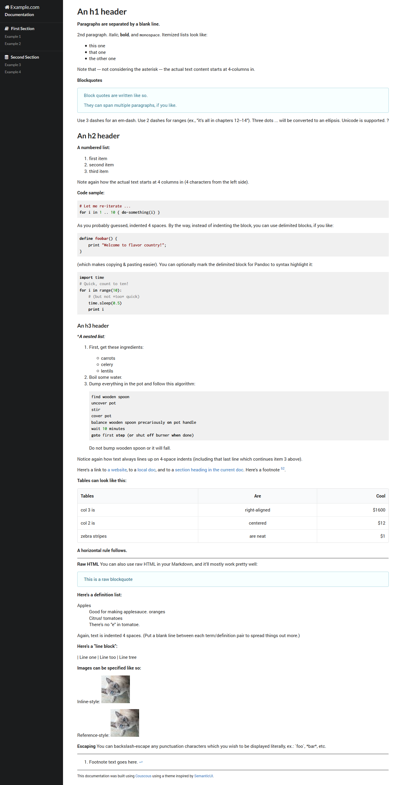

# Couscous - Semantic UI Theme

This is a [Semantic UI](http://semantic-ui.com) inspired theme for the [Couscous](http://couscous.io)



## Usage
To use this template locally, download the files and update the template directory in your `couscous.yml` configuration file:

```yml
template:
  directory: ./semanticui
```

Have a look in the  `demo` folder for some examples.

---

Semantic UI [documentation](http://semantic-ui.com/introduction/getting-started.html)

Couscous [documentation](http://couscous.io/docs/getting-started.html)